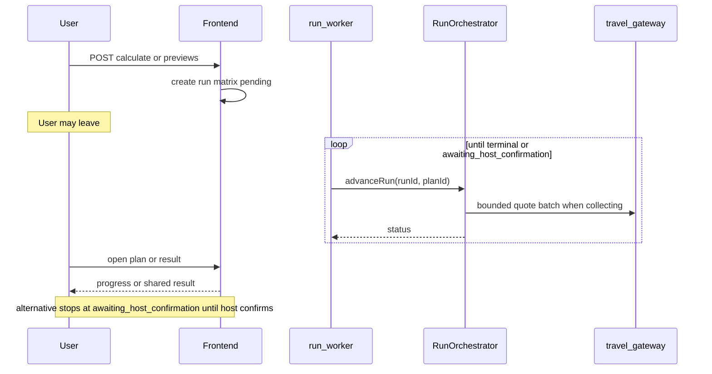

# Background Recommendation Run Worker Design

**Status:** Approved direction 2026-07-28 (operator chose Compose `run-worker`; scope = automatic + alternative preview advancement)

**Date:** 2026-07-28

## Problem

Recommendation runs only advance when a browser holding a participant edit token POSTs `/api/plans/[code]/runs/[runId]/advance`. Leaving the page (normal WeChat / mobile behavior) stops collection. After the rolling inactivity deadline the next advance fails with `RUN_STALE_EXPIRED`. Users expect: after「开始见面」or starting a private alternative preview, they can leave and the system keeps querying until a terminal state.

## Decision

Add a third private Compose service, `run-worker`, on the Alibaba Cloud ECS stack. It continuously advances nonterminal **automatic** and **alternative** runs by calling the same lease-guarded `advanceRun` path the HTTP route uses. Host confirmation of alternatives remains a human action (`x-host-token` only). Browser pages become progress viewers; they may still optionally advance when open, but must not be required for completion.

## Why a separate worker

- Fits the shipped mainland topology: one ECS, Docker Compose, private network, unexposed gateway.
- Survives frontend restarts and does not tie query progress to Next.js request lifetime.
- Reuses existing orchestrator, lease, stale, publication, and gateway serialization instead of inventing a second pipeline.
- Avoids public cron endpoints and keeps secrets off the browser.

## Scope

**In scope**

- Background advancement for `kind = automatic` and `kind = alternative` while status is one of: `pending`, `collecting`, `cooling_down`, `calculating`, `validating`.
- Compose packaging, health/restart policy, deployment docs, and focused regressions.
- Copy/IA: progress UI must state that users can leave; remove “must keep page open” as the primary instruction.
- Keep client-side advance as an optional accelerator when a participant tab is open (lease prevents duplicate work).

**Out of scope**

- Background host confirmation or any auto-replace of the shared result.
- ACK, multi-instance workers, Redis/SQS, or Vercel as the primary background runner for China.
- Changing saving/fast policy, quote facts, or publication RPCs.
- Guaranteeing completion on Vercel-only overseas deploys without a worker (client advance remains the fallback there).

## Runtime contract

### Worker behavior

1. Poll active runs on a short interval (default **3s**, env-overridable). Prefer one global in-flight advance at a time (or a small cap ≤2) so the travel gateway’s serial limiter is not stampeded.
2. Select runs where:
   - `kind` in (`automatic`, `alternative`)
   - `status` in (`pending`, `collecting`, `cooling_down`, `calculating`, `validating`)
   - Prefer oldest `started_at` / `updated` first for fairness.
3. For `cooling_down`, still call `advanceRun` (orchestrator no-ops until `retry_after`); do not invent a second cooldown clock.
4. Stop selecting a run when status becomes `completed`, `incomplete`, `failed`, or `awaiting_host_confirmation`.
5. Use service-role Supabase credentials and the same `TRAVEL_GATEWAY_*` / agent env as the frontend. Never expose a host port. Never accept browser tokens.
6. On process start, immediately scan once so pending runs created while the worker was down resume without waiting for a user.
7. Log run/trace/status on unexpected advance failures; public diagnostics stay allowlisted codes only.

### Authority and safety

- Worker calls `advanceRun` in-process (same Node package as the app libraries), not via a public HTTP route.
- Do not add an unauthenticated public “advance all” API. If an internal HTTP hook is needed for ops smoke, it must require a server-only shared secret and remain unbound on the host.
- Existing advance lease (about 5 minutes) remains the concurrency lock between worker and any open browser tab.
- Rolling inactivity deadline remains (**2 hours** active / **7 days** awaiting host confirmation). While the worker is healthy it refreshes `stale_after` through normal advances. If the worker is down longer than the deadline, expiry on the next advance still fails closed with `RUN_STALE_EXPIRED`.
- Publication, policy replay, quote `(participantId, quoteId)` binding, and “no estimates” rules are unchanged.
- Alternative runs must not be worker-confirmed; only `confirm_alternative_result` / host-token path may replace the shared city.

### Packaging (Aliyun Compose)

Extend `deploy/aliyun/compose.yaml`:

- `frontend` — unchanged role (loopback `3001`).
- `travel-gateway` — unchanged (no host port).
- `run-worker` — new service on the private network; `depends_on` healthy gateway; `restart: unless-stopped`; no ports; same secret env class as frontend (service role, gateway token, Amap/DeepSeek as required by orchestrator path).

Build options (implementation picks the smaller correct one):

- Dedicated worker Dockerfile/target that installs deps, compiles or runs a worker entry under `services/recommendation-run-worker` (or repo `src/worker`), production Node 20, unprivileged `node` user; **or**
- Multi-stage reuse of the app image with a different `CMD` that only starts the worker entry (must not start Next.js).

Healthcheck: process liveness (e.g. worker writes a heartbeat file/mtime, or a trivial local `/healthz` on loopback only if that stays unpublished).

### Product / UI

- Plan and result progress copy: users **can leave**; returning shows current status. Do not instruct “必须一直开着页面” as the primary path.
- Plan page keeps a clear link to progress/result for in-progress and terminal states (already required for stuck UX).
- Optional client advance may remain for snappier updates when the tab is open; success criteria do not depend on it.
- Diagnostic `RUN_STALE_EXPIRED` copy may still mention interruption when the **worker** was down too long, not when the user merely left a healthy system.

### Overseas Vercel

Vercel Services remains overseas fallback. v1 does **not** require a Vercel background worker. There, open-tab advance may still be needed. China acceptance for “leave and finish” is proven on ECS with `run-worker`.

## Acceptance

- After `POST .../calculate` (or preview create), closing all browsers still yields eventual `completed`, `incomplete`, or `failed` (or `awaiting_host_confirmation` for alternatives) without further client POSTs to advance.
- Two participants / multi-mode matrix (order of ~100+ route tasks) can finish under worker-only advancement with gateway available; incomplete coverage still publishes nothing.
- Concurrent open result tab + worker does not double-apply the same batch (lease).
- Worker has no published host port; compose config test covers the third service.
- Host confirmation remains token-gated; worker never shares an alternative result.
- Root/gateway gates remain green for touched packages; add focused worker unit tests (selection + loop with mocked `advanceRun`).

## Non-goals

- Replacing deterministic policy or inventing supplier quotes.
- Multi-region worker fleets.
- Auto-confirming alternative cities.
- Claiming Vercel parity for leave-and-finish in this release.
